# FlowTest V3.0 高清 UI 模块设计图

分辨率：2560×1440；每张图仅展示一个核心模块。

## 01. 01_quality_command_center
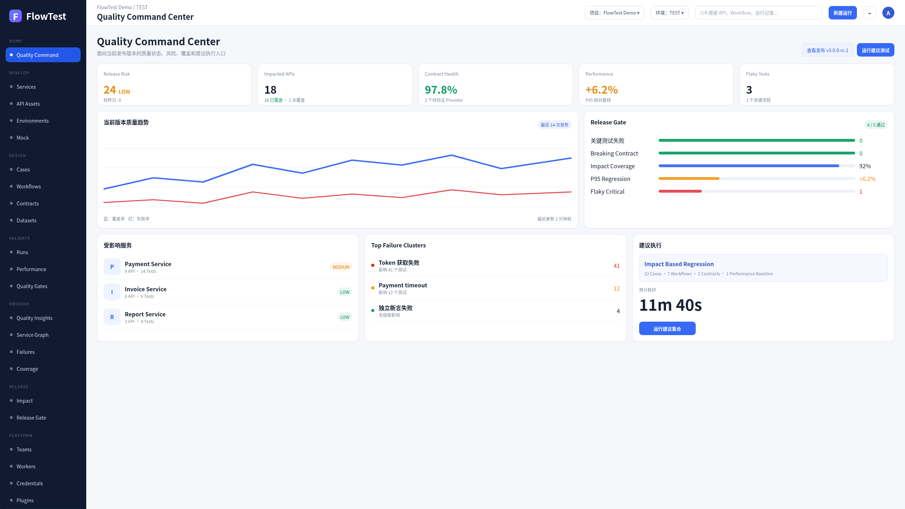

## 02. 02_service_catalog
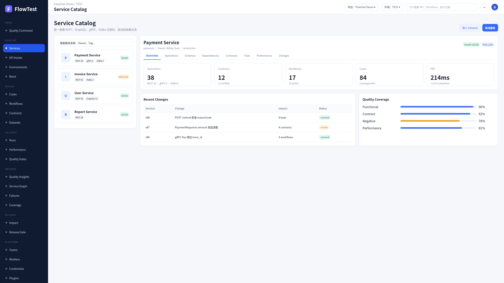

## 03. 03_protocol_workbench
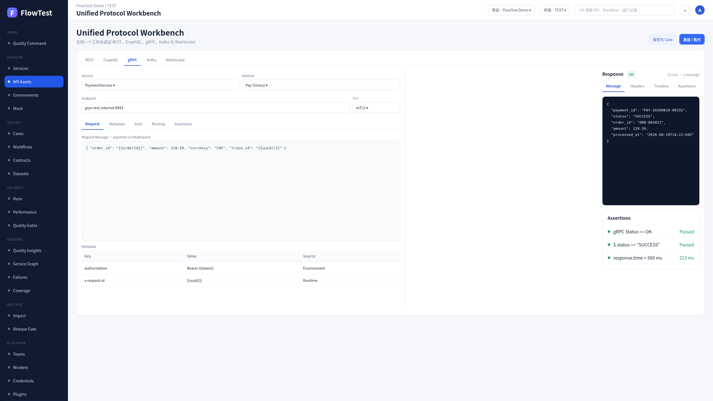

## 04. 04_workflow_studio_build
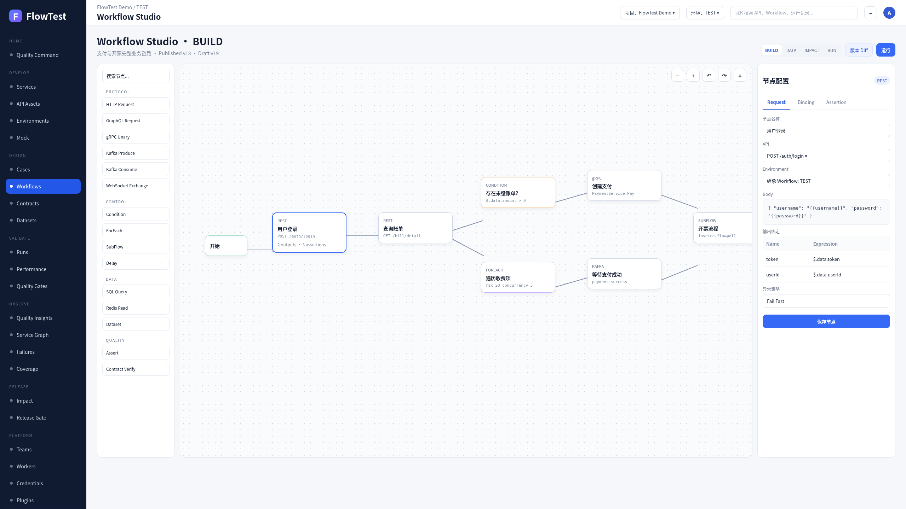

## 05. 05_workflow_impact_run
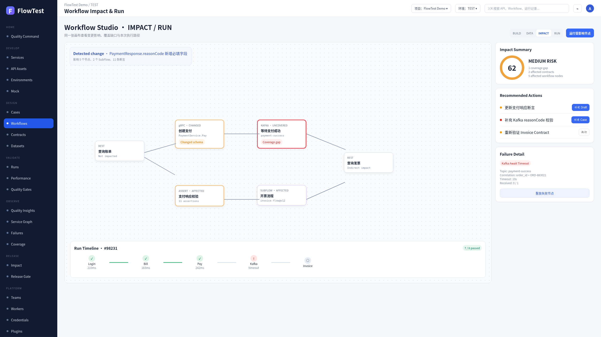

## 06. 06_performance_lab
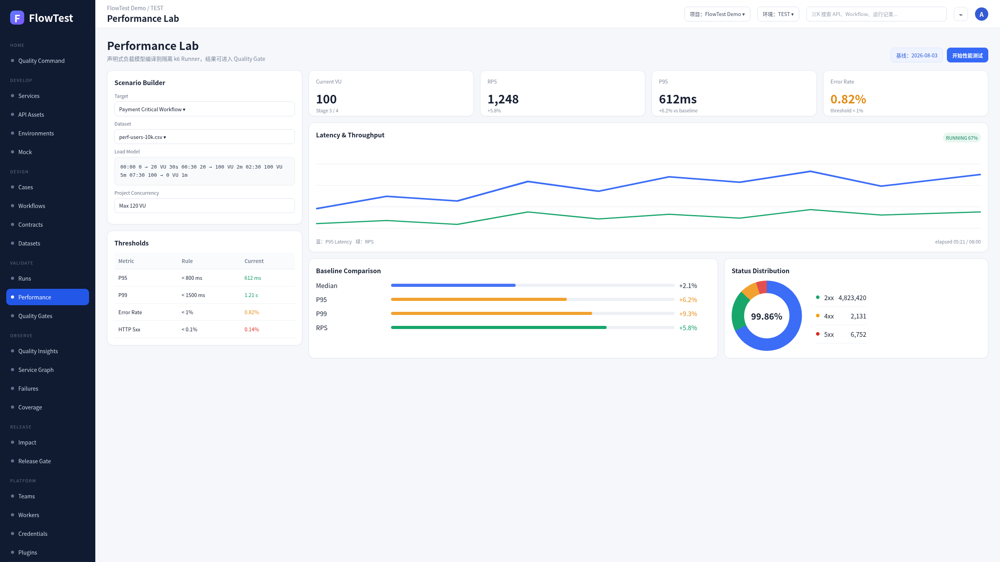

## 07. 07_contract_hub
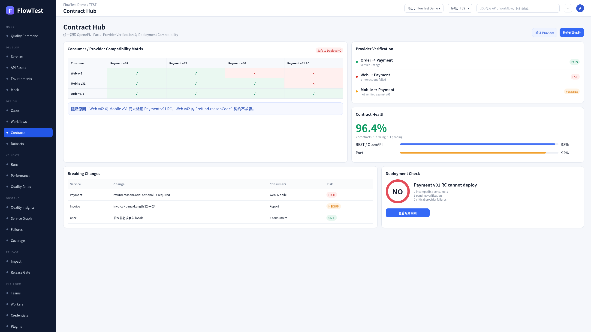

## 08. 08_change_impact_analysis
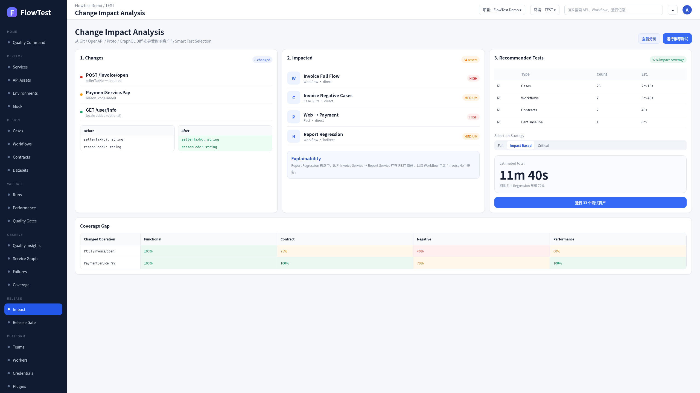

## 09. 09_quality_insights
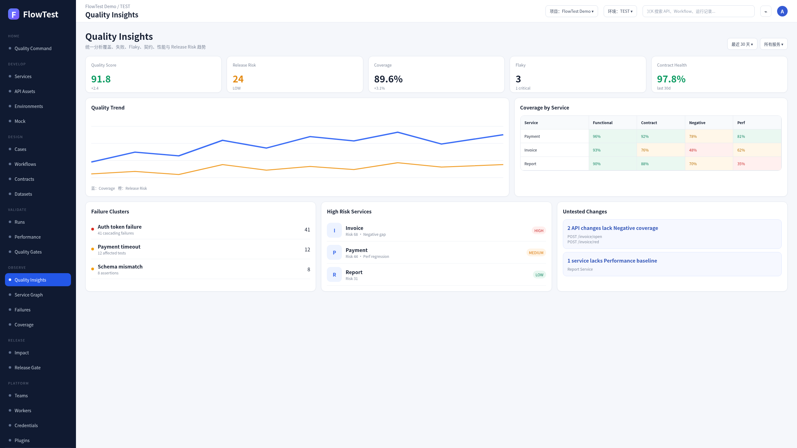

## 10. 10_ai_change_set_review
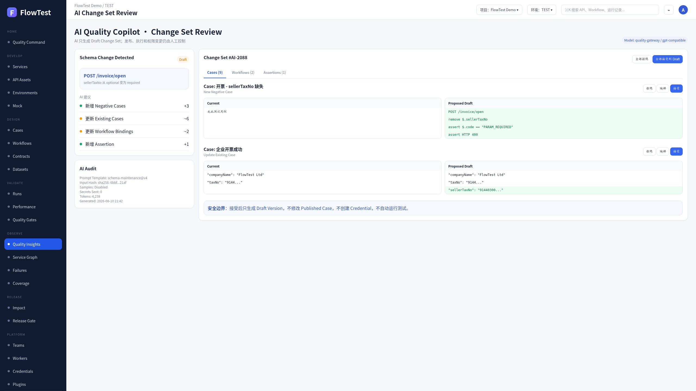

## 11. 11_execution_fabric
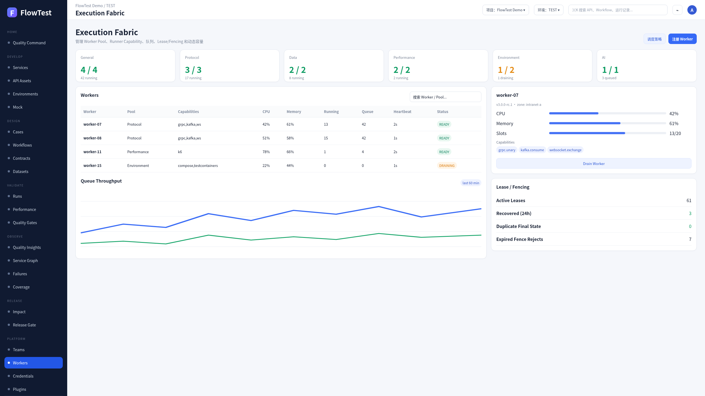

## 12. 12_environment_lab
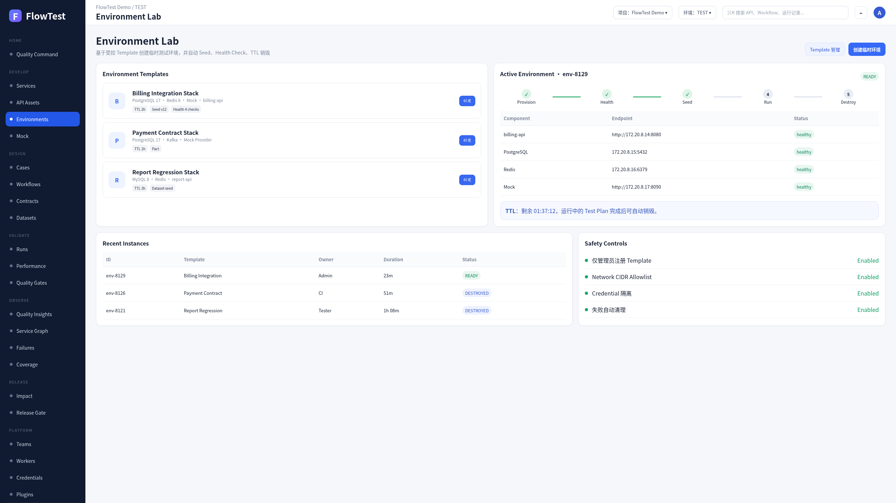
