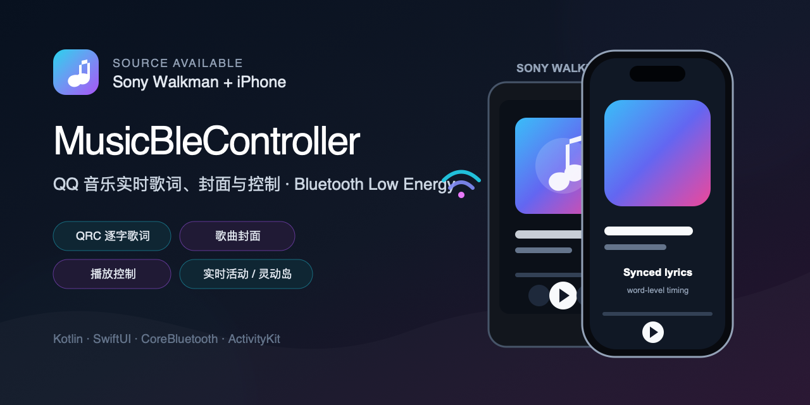
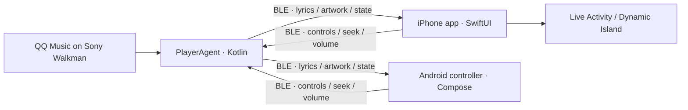

# MusicBleController

<p align="center">
  <a href="README.md"><strong>English</strong></a> ·
  <a href="README.zh-CN.md">简体中文</a>
</p>

<p align="center">
  <strong>Your Walkman plays. Your phone takes control.</strong><br>
  QQ Music lyrics, artwork and playback controls — on iPhone and Android.<br>
  音乐留在 Walkman，歌词和控制来到手机。
</p>

<p align="center">
  <a href="https://github.com/a3384379/MusicBleController/actions/workflows/build.yml"></a>
  
  
  
  
</p>

<p align="center">
  <a href="#quick-start">Quick start</a> ·
  <a href="#what-you-get">Features</a> ·
  <a href="README.zh-CN.md">中文安装指南</a> ·
  <a href="docs/V4_ACCEPTANCE_STATUS.md">V4 status</a> ·
  <a href="https://github.com/a3384379/MusicBleController/issues/new/choose">Report your device</a>
</p>

Love listening on your Sony Walkman, but want to check a lyric or skip a track
from your phone? MusicBleController connects QQ Music on an Android Walkman to
a native iPhone or Android companion over **Bluetooth Low Energy**. Follow
word-synced lyrics, see the cover, and control playback without reaching for
the player. On iPhone, bring that experience to **Dynamic Island and Live Activities**.

**This is a remote control and media-display companion, not an audio streamer.**
Audio stays on the Walkman's existing output; BLE carries playback commands,
lyrics, artwork and state. The companion needs no cloud relay. QQ Music's own
network and account requirements are unchanged.

> [!NOTE]
> **V4 is on `master` as a development milestone, not a fully accepted release.**
> Track-switch/artwork latency tails, first-word coverage and a long-run Sony
> Bluetooth-stack failure remain open. [See measured results and the acceptance checklist](docs/V4_ACCEPTANCE_STATUS.md).

> [!IMPORTANT]
> The current implementation supports **QQ Music on Android only**. It is an
> unofficial community project and is not affiliated with Sony, Apple, Tencent
> or QQ Music.

If this is the Walkman companion you have been looking for, **star the project**
to bookmark it. A [device compatibility report](https://github.com/a3384379/MusicBleController/issues/new/choose)
or [discussion](https://github.com/a3384379/MusicBleController/discussions) is just as welcome.

<p align="center">
  
  <br><sub>Project concept illustration — not a device screenshot.</sub>
</p>

## 中文简介

让 Walkman 继续负责播放，用手机看逐字歌词、看封面、切歌、调音量。
MusicBleController 将 **Sony 上的 QQ 音乐**通过 BLE 连接到 iPhone 或 Android
控制端，iPhone 还支持**灵动岛与锁屏实时活动**。它传输的是状态与控制，**不传输音频**，
无需为伴侣应用搭建云端服务。安装条件、权限和已知限制见[完整中文指南](README.zh-CN.md)。

## What you get

| Feature | In everyday use | Platform |
|---|---|---|
| Word-synced QRC lyrics | Follow the current word; browse full lyrics, translations and romanization when available | iPhone / Android |
| Dynamic Island & Live Activities | View current playback and use supported controls from iPhone system surfaces | iPhone |
| Playback remote | Play/pause, next/previous, seek and adjust volume from your phone | iPhone / Android |
| Artwork & lyric caches | Preview-first artwork, HQ upgrades and validated full-lyric reuse | iPhone / Android; V4 lyric-validation handshake on iPhone |
| Listening history | Browse previous tracks and revisit listening activity | iPhone / Android |
| On-device diagnostics | Inspect connection, lyrics and artwork when something does not sync | Sony / iPhone / Android |

Word highlighting requires local QRC word timing; missing translations or
romanization are not generated. Dynamic Island requires a supported iPhone.

<details>
  <summary>Earlier UI structure illustrations (not current V4 screenshots)</summary>
  <p align="center">
    
    
    
  </p>
</details>

## Designed around the Walkman

- **Local link, native apps:** Kotlin on Sony, SwiftUI/CoreBluetooth on iPhone,
  and Jetpack Compose on Android. No companion server to host.
- **Cache-first media:** indexed local QRC, compressed transfers and reusable
  artwork; V4 iPhone/Sony lyric validation can skip unchanged full-lyric transfers.
- **Current song stays authoritative:** identity, generation and transfer guards
  reject late results from previous tracks. No guessed next song is displayed.
- **Control before bulk data:** playback and current-word traffic can preempt
  larger media transfers; health checks and reconnect paths handle interruptions.
- **Measured, not promised:** cross-platform CI, real-device smoke tools and
  [published SLO gaps](docs/V4_ACCEPTANCE_STATUS.md). No claim of zero latency
  or universal Walkman compatibility.

## How it works



The Sony device is the authoritative media source. `PlayerAgentApp` reads
MediaSession, notifications and QQ Music's local QRC cache. The iOS and Android
apps are interchangeable BLE controllers, caches and presentation layers; only
up to two controllers can stay connected to one Sony device at the same time.
Direct replies return to the requester while authoritative playback, lyric and
artwork state is synchronized to both controllers. No external server is required.

This describes the implementation, not a completed V4 two-controller validation:
the current real-device optimization focus is **one iPhone + one Sony**.
Mixed-controller V4 acceptance is still deferred.

## Compatibility

| Component | Requirement |
|---|---|
| Music source | QQ Music for Android |
| Sony side | Android 6.0+; tested on Sony NW-WM1AM2 (Android 11) |
| iPhone side | iOS 18.0+ with Bluetooth enabled |
| Android controller | Android 6.0+ with BLE; Android 12+ requires Nearby Devices permission |
| Development | Android Studio/JDK and Xcode with an Apple Development team |

Other Android-based Sony Walkman models may work, but hardware and firmware
differences have not all been validated. Real-device testing is required; the
iOS Simulator cannot validate the BLE media path.

## Quick start

You need **one Sony running QQ Music + one phone controller**. Choose iPhone or
Android; you do not need to install both controllers. For current V4, build
`master`. The [v0.1.0 Preview](https://github.com/a3384379/MusicBleController/releases/tag/v0.1.0)
is an older release and does not represent V4. iPhone installation requires
Xcode and your own signing configuration; there is no universal installable IPA.

### 1. Build the Sony PlayerAgent

```bash
git clone https://github.com/a3384379/MusicBleController.git
cd MusicBleController
bash gradlew :PlayerAgentApp:assembleDebug
```

Install `PlayerAgentApp/build/outputs/apk/debug/PlayerAgentApp-debug.apk` on the
Sony player. Grant notification access, enable the required accessibility
service, then start the PlayerAgent foreground service.

### 2. Build an Android controller

```bash
bash gradlew :ControllerApp:assembleDebug
```

Install `ControllerApp/build/outputs/apk/debug/ControllerApp-debug.apk` on an
Android phone. Grant Bluetooth and notification permissions, open the app, and
connect to `SonyPlayerAgent`. The controller includes a Compose player,
word-synced and full-screen lyrics, Preview/HQ artwork, playback history,
statistics, settings, MediaStyle background controls and diagnostics.

### 3. Build the iPhone app

1. Open `IOSBleFeasibility/IOSBleFeasibility.xcodeproj` in Xcode.
2. Select your Apple Development team for the app and Live Activity extension.
3. Replace the sample bundle identifiers and App Group with identifiers owned
   by your team.
4. Build and install the app on a physical iPhone running iOS 18 or later.
5. Keep both devices nearby, open the iPhone app and connect to
   `SonyPlayerAgent`.

For deeper implementation and troubleshooting details, see:

- [Project overview](docs/PROJECT_OVERVIEW.md)
- [BLE protocol](docs/BLE_PROTOCOL.md)
- [Lyrics architecture](docs/LYRICS_ARCHITECTURE.md)
- [Album-art architecture](docs/ALBUM_ART_ARCHITECTURE.md)
- [Smoke-test guide](docs/SMOKE_TEST_GUIDE.md)

## Repository layout

| Path | Purpose |
|---|---|
| `PlayerAgentApp/` | Sony/Android media agent and BLE GATT server |
| `IOSBleFeasibility/` | Native iPhone app and Live Activity extension |
| `ControllerApp/` | Jetpack Compose Android BLE V2 controller and foreground connection service |
| `docs/` | Protocol and architecture documentation |
| `tools/` | iOS, Android and cross-device smoke tests |

## Validation

```bash
# Android unit tests and debug builds
bash gradlew \
  :PlayerAgentApp:testDebugUnitTest :PlayerAgentApp:assembleDebug \
  :ControllerApp:testDebugUnitTest :ControllerApp:assembleDebug

# Installed-device quick smoke tests
./tools/smoke/run_all_smoke_tests.sh --quick --json
```

The repository also includes long-play tests for album art, lyrics, controls,
reconnect behavior and current-word timing. See the
[smoke-test documentation](tools/smoke/README.md) before running tests that
operate real devices.

## Project status

This is an actively developed, device-specific project rather than a polished
App Store product. The BLE protocol preserves compatibility between older and
newer builds, but setup currently expects familiarity with Android sideloading
and Xcode signing.

| Area | V4 status |
|---|---|
| iPhone & Sony product UI | Implemented |
| Trace/SLO tooling and cache validation | Implemented; performance goals are not all met |
| Cold track handoff & first-word latency | Optimization and acceptance in progress |
| Cross-device predictive prefetch | Not enabled: the tested QQ Music version exposes no reliable queue |
| Mixed controllers and long-run stability | Acceptance remains incomplete |

See the [acceptance checklist](docs/V4_ACCEPTANCE_STATUS.md) and the
[merge verification follow-up](https://github.com/a3384379/MusicBleController/pull/7#issuecomment-5548822515),
including the snapshot-storage XCTest that passed only after a retry.

Issues and pull requests are welcome, especially for:

- validation on additional Android-based Walkman models;
- reproducible BLE performance traces;
- QQ Music metadata, QRC lyric or album-art edge cases;
- setup documentation and translations.

If MusicBleController is useful to you, consider starring the repository. It
helps other Sony Walkman and iPhone users discover the project.

## Acknowledgements

This repository is **source-available**, with no project-wide license selected.
Public visibility does not grant a general right to reuse or redistribute it.
No license change is part of V4.

The QRC decryption implementation includes work derived from open-source
projects credited in [THIRD_PARTY_NOTICES.md](THIRD_PARTY_NOTICES.md).
