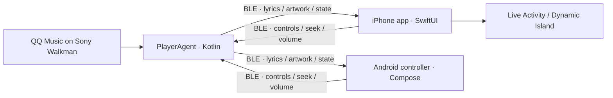

# MusicBleController

<p align="center">
  <a href="README.md"><strong>English</strong></a> ·
  <a href="README.zh-CN.md">简体中文</a>
</p>

<p align="center">
  <strong>Turn a Sony Android Walkman into a Bluetooth music source for iPhone and Android.</strong><br>
  <strong>让 iPhone 与 Android 控制端实时获取 Sony 播放器上的 QQ 音乐歌词、封面和播放状态。</strong>
</p>

<p align="center">
  
  
  
  
</p>

MusicBleController is a source-available, cross-platform companion for Sony
Walkman devices running Android. A lightweight agent reads QQ Music playback
metadata, QRC lyrics and album art, then streams them over Bluetooth Low Energy
(BLE) to either a native SwiftUI iPhone app or a Jetpack Compose Android
controller. Both clients provide playback controls, synced lyrics and artwork
caching; iPhone additionally supports Dynamic Island and Live Activities.

> [!IMPORTANT]
> The current implementation supports **QQ Music on Android only**. It is an
> unofficial community project and is not affiliated with Sony, Apple, Tencent
> or QQ Music.

## 中文简介

MusicBleController 是面向 **Sony Android Walkman、iPhone 与 Android 控制端**
的 QQ 音乐 BLE 伴侣项目。Sony 端读取 QQ 音乐的播放状态、本地 QRC 逐字歌词和
通知封面，再通过低功耗蓝牙实时同步到 SwiftUI iPhone App 或 Jetpack Compose
Android App；两种控制端都支持歌词高亮、封面缓存和播放控制，iPhone 还支持锁屏
实时活动与灵动岛，全程不依赖云端中转服务。

- 支持 QQ 音乐 QRC 逐字歌词、翻译和罗马音数据；
- 支持预览封面优先传输、高清封面后台升级和缓存复用；
- 支持播放、暂停、切歌、进度和音量控制；
- 针对 Sony 播放器性能和 BLE 带宽做了队列抢占、压缩传输、重试和断线恢复优化。

当前仅支持 Android 版 QQ 音乐，需要自行安装 Sony 端应用，并使用自己的 Apple
开发者签名构建 iOS App。安装、权限、兼容性、排障和开发说明请阅读
[完整简体中文文档](README.zh-CN.md)。

## Preview

<p align="center">
  
</p>

<details>
  <summary>More UI and diagnostic previews</summary>
  <p align="center">
    
    
  </p>
</details>

## Why this project?

Sony's Android-based Walkman players can run QQ Music, but their playback state
does not naturally integrate with an iPhone. This project connects the two
devices without a cloud service:

- **Synced QQ Music lyrics** — parses encrypted QRC lyrics, including word-level
  timing, translation and romanization where available.
- **Fast album art** — preview-first BLE delivery, HQ background upgrades,
  CRC validation and stale-while-revalidate caching.
- **Remote playback controls** — play/pause, next, previous, seek and volume.
- **Two native controllers** — SwiftUI on iPhone and Jetpack Compose on Android,
  with full-screen lyrics, history, settings and diagnostics.
- **Native iPhone extras** — lock-screen Live Activity and Dynamic Island
  support.
- **Connection recovery** — capability negotiation, health checks, reconnect
  protection and old-client protocol fallback.
- **Built for slow hardware** — priority-based BLE scheduling, compressed lyric
  transfers and indexed QRC caches reduce work on the Walkman.
- **Observable and testable** — on-device diagnostics plus iOS, Android and
  cross-device smoke-test suites.

## How it works



The Sony device is the authoritative media source. `PlayerAgentApp` reads
MediaSession, notifications and QQ Music's local QRC cache. The iOS and Android
apps are interchangeable BLE controllers, caches and presentation layers; only
one controller should connect to a Sony device at a time. No external server is
required.

## Compatibility

| Component | Requirement |
|---|---|
| Music source | QQ Music for Android |
| Sony side | Android 6.0+; tested on Sony NW-WM1AM2 (Android 11) |
| iPhone side | iOS 18.0+ with Bluetooth enabled |
| Android controller | Android 6.0+ with BLE; Android 12+ requires Nearby Devices permission |
| Development | Android Studio/JDK and Xcode with an Apple Development team |

Other Android-based Sony Walkman models may work, but hardware and firmware
differences have not all been validated. Real-device testing is required; the
iOS Simulator cannot validate the BLE media path.

## Getting started

### 1. Build the Sony PlayerAgent

```bash
git clone https://github.com/a3384379/MusicBleController.git
cd MusicBleController
bash gradlew :PlayerAgentApp:assembleDebug
```

Install `PlayerAgentApp/build/outputs/apk/debug/PlayerAgentApp-debug.apk` on the
Sony player. Grant notification access, enable the required accessibility
service, then start the PlayerAgent foreground service.

### 2. Build an Android controller

```bash
bash gradlew :ControllerApp:assembleDebug
```

Install `ControllerApp/build/outputs/apk/debug/ControllerApp-debug.apk` on an
Android phone. Grant Bluetooth and notification permissions, open the app, and
connect to `SonyPlayerAgent`. The controller includes a Compose player,
word-synced and full-screen lyrics, Preview/HQ artwork, playback history,
statistics, settings, MediaStyle background controls and diagnostics.

### 3. Build the iPhone app

1. Open `IOSBleFeasibility/IOSBleFeasibility.xcodeproj` in Xcode.
2. Select your Apple Development team for the app and Live Activity extension.
3. Replace the sample bundle identifiers and App Group with identifiers owned
   by your team.
4. Build and install the app on a physical iPhone running iOS 18 or later.
5. Keep both devices nearby, open the iPhone app and connect to
   `SonyPlayerAgent`.

For deeper implementation and troubleshooting details, see:

- [Project overview](docs/PROJECT_OVERVIEW.md)
- [BLE protocol](docs/BLE_PROTOCOL.md)
- [Lyrics architecture](docs/LYRICS_ARCHITECTURE.md)
- [Album-art architecture](docs/ALBUM_ART_ARCHITECTURE.md)
- [Smoke-test guide](docs/SMOKE_TEST_GUIDE.md)

## Repository layout

| Path | Purpose |
|---|---|
| `PlayerAgentApp/` | Sony/Android media agent and BLE GATT server |
| `IOSBleFeasibility/` | Native iPhone app and Live Activity extension |
| `ControllerApp/` | Jetpack Compose Android BLE V2 controller and foreground connection service |
| `docs/` | Protocol and architecture documentation |
| `tools/` | iOS, Android and cross-device smoke tests |

## Validation

```bash
# Android unit tests and debug builds
bash gradlew \
  :PlayerAgentApp:testDebugUnitTest :PlayerAgentApp:assembleDebug \
  :ControllerApp:testDebugUnitTest :ControllerApp:assembleDebug

# Installed-device quick smoke tests
./tools/smoke/run_all_smoke_tests.sh --quick --json
```

The repository also includes long-play tests for album art, lyrics, controls,
reconnect behavior and current-word timing. See the
[smoke-test documentation](tools/smoke/README.md) before running tests that
operate real devices.

## Project status

This is an actively developed, device-specific project rather than a polished
App Store product. The BLE protocol preserves compatibility between older and
newer builds, but setup currently expects familiarity with Android sideloading
and Xcode signing.

Issues and pull requests are welcome, especially for:

- validation on additional Android-based Walkman models;
- reproducible BLE performance traces;
- QQ Music metadata, QRC lyric or album-art edge cases;
- setup documentation and translations.

If MusicBleController is useful to you, consider starring the repository. It
helps other Sony Walkman and iPhone users discover the project.

## Acknowledgements

The QRC decryption implementation includes work derived from open-source
projects credited in [THIRD_PARTY_NOTICES.md](THIRD_PARTY_NOTICES.md).
