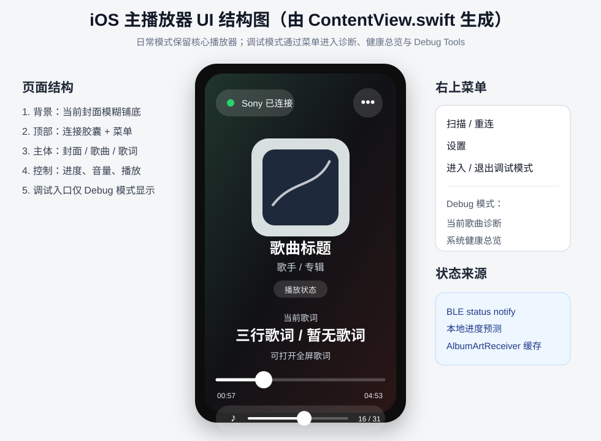
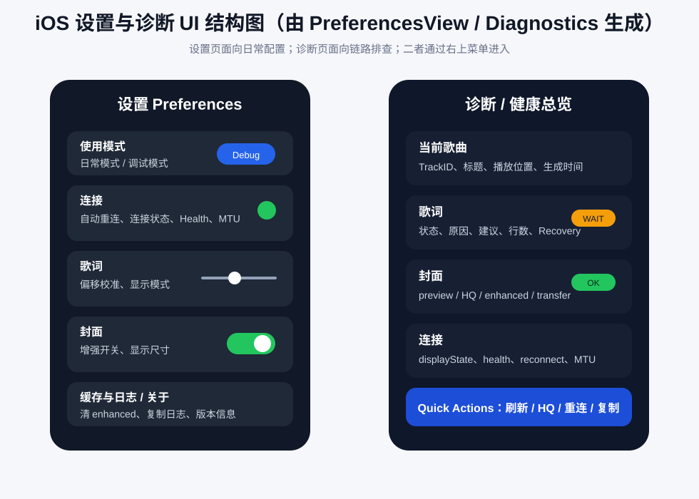
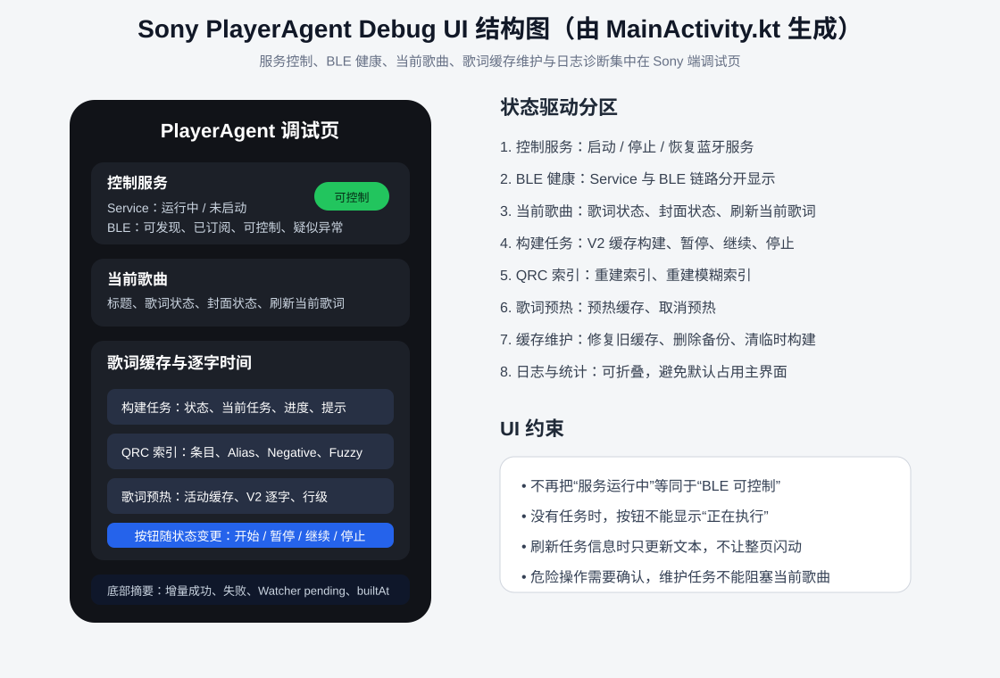
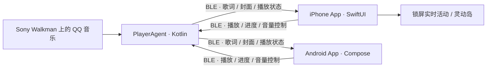

# MusicBleController

<p align="center">
  <a href="README.md">English</a> ·
  <a href="README.zh-CN.md"><strong>简体中文</strong></a>
</p>

<p align="center">
  <strong>让 iPhone 与 Android 控制端实时获取 Sony Walkman 上的 QQ 音乐歌词、封面和播放状态。</strong><br>
  <strong>一个不依赖云端中转的 Sony 播放器跨平台蓝牙音乐伴侣。</strong>
</p>

<p align="center">
  
  
  
  
</p>

MusicBleController 是一个面向 Sony Android Walkman、iPhone 和 Android 手机的
QQ 音乐状态同步与远程控制项目。运行在 Sony 播放器上的轻量 Android 服务负责读取
QQ 音乐的 MediaSession、通知封面和本地 QRC 歌词，再通过低功耗蓝牙（BLE）传输到
原生 SwiftUI iPhone App 或 Jetpack Compose Android App。两种控制端都可以显示
逐字歌词、歌曲封面和播放进度，也可以控制播放、切歌、进度和音量；iPhone 还支持
锁屏实时活动与灵动岛。

> [!IMPORTANT]
> 当前版本只支持 **Android 版 QQ 音乐**，不支持 Apple Music、Spotify、网易云音乐
> 或其他播放器。本项目是非官方社区项目，与 Sony、Apple、腾讯或 QQ 音乐没有隶属、
> 授权或合作关系。

> [!NOTE]
> 项目代码目前可公开查看，但仓库所有者尚未选择项目级许可证。在许可证明确之前，
> 请不要假定代码具备自由复制、修改或再分发授权。

## 界面预览

<p align="center">
  
</p>

<details>
  <summary>查看更多 iOS 设置、诊断和 Sony 端界面</summary>
  <p align="center">
    
    
  </p>
</details>

## 为什么做这个项目？

Sony 的 Android Walkman 可以安装 QQ 音乐，但它的播放状态、QRC 逐字歌词和封面
无法自然同步到 iPhone。本项目让两台设备在附近直接通信，不需要搭建服务器，也不需要
把播放信息上传到第三方云端。

项目重点不只是“能够连接”，还包括在 Sony 播放器性能有限、BLE 带宽较低的情况下，
尽可能及时和稳定地展示当前歌曲：

- **QQ 音乐逐字歌词**：解析本地加密 QRC 歌词，支持逐字时间、翻译和罗马音数据；
- **快速封面显示**：优先发送小型预览图，再在后台升级高清封面；
- **完整播放控制**：支持播放、暂停、上一首、下一首、进度和音量；
- **双原生控制端**：iPhone 使用 SwiftUI，Android 使用 Jetpack Compose，均支持
  主播放器、完整歌词、历史、设置与诊断；
- **iPhone 专属能力**：使用 ActivityKit 提供锁屏实时活动和灵动岛；
- **弱性能设备优化**：使用可抢占 BLE 队列、压缩歌词、索引缓存和分级封面；
- **兼容与恢复**：支持新旧协议协商、健康探测、有限重试和自动重连；
- **可诊断与可测试**：两端均提供诊断日志，并包含 Android、iOS 和跨端冒烟测试。

## 工作原理



Sony 端是播放状态、歌词和封面的权威数据源，iPhone 与 Android App 是可替换的
控制、缓存和展示端（同一时刻只建议连接一个控制端）：

1. Sony `PlayerAgentApp` 启动 BLE GATT Server，并监听 QQ 音乐状态与本地 QRC 文件；
2. iPhone `BLETestManager` 或 Android `ControllerConnectionService` 扫描并连接
   `SonyPlayerAgent`；
3. 控制端通过命令特征发送 JSON 控制命令；
4. Sony 通过状态特征返回播放状态、歌词窗口、完整歌词和二进制封面分包；
5. 控制端合并传输结果并更新播放器、歌词和缓存；iPhone 同时更新 Live Activity。

固定 BLE UUID、已有控制命令和旧协议兼容路径会被保留，新功能只在双方确认能力后启用。

## 歌词、封面与连接性能

### 歌词

- 当前行附近的歌词窗口优先返回，用于快速构建 iPhone 歌词界面；
- 完整歌词在后台传输，并支持 zlib 压缩、CRC 校验和缺包重试；
- Sony 端使用版本化 QRC 解析索引，避免每首歌都扫描和解析大型缓存目录；
- 切歌时通过 `trackId`、generation 和 transferId 阻止旧歌曲结果覆盖新歌曲；
- 当前词根据下一词或下一行边界调度，暂停时停止无意义轮询。

### 封面

- 小尺寸 preview 具有较高优先级，高清 HQ 封面在空闲时后台升级；
- iPhone 使用 stale-while-revalidate 策略，可信缓存可以先显示再后台复验；
- Sony 端缓存已经编码的 JPEG，减少慢设备上的重复压缩；
- 分包传输包含歌曲身份、传输代次和 CRC 校验，避免串歌或残缺图片覆盖当前封面。

### 蓝牙与重连

- 控制响应、播放状态和当前词可以抢占完整歌词、高清封面等大任务；
- 播放中和暂停中采用不同的静默探测周期，避免正常状态下频繁重连；
- 新协议使用轻量 PING/PONG，旧 Sony 版本自动回退到原有状态请求；
- 连续探测失败后才执行硬重连，明确断开事件仍会立即处理。

## 兼容性

| 组件 | 当前要求 |
|---|---|
| 音乐来源 | Android 版 QQ 音乐 |
| Sony 端 | Android 6.0+；已在 Sony NW-WM1AM2（Android 11）验证 |
| iPhone 端 | iOS 18.0+，需要开启蓝牙 |
| Android 控制端 | Android 6.0+，需要 BLE；Android 12+ 需要“附近的设备”权限 |
| Android 开发 | Android Studio、JDK 和 Android SDK |
| iOS 开发 | Xcode、Apple Development Team 和实体 iPhone |

其他基于 Android 的 Sony Walkman 机型可能可以运行，但不同地区固件、Android 版本、
蓝牙芯片和 QQ 音乐版本可能影响结果。欢迎使用仓库的“设备兼容性报告”Issue 表单反馈。

## 安装与使用

### 1. 安装 Sony 端 PlayerAgent

可以从 [v0.1.0 Preview](https://github.com/a3384379/MusicBleController/releases/tag/v0.1.0)
下载用于体验的 Android APK，也可以自行构建：

```bash
git clone https://github.com/a3384379/MusicBleController.git
cd MusicBleController
bash gradlew :PlayerAgentApp:assembleDebug
```

自行构建的 APK 位于：

```text
PlayerAgentApp/build/outputs/apk/debug/PlayerAgentApp-debug.apk
```

预发布 APK 使用 Release 源集构建，但采用开发证书签名，仅适合测试。如果设备上已有
其他证书签名的同包名应用，Android 可能要求先卸载旧版本；卸载会清除该应用的本地数据。

安装后请在 Sony 播放器上完成以下授权：

1. 允许蓝牙相关权限；
2. 授予通知读取权限，用于获取 QQ 音乐状态和通知封面；
3. 启用 QQ Music Lyric Detector 辅助功能服务；
4. 按系统版本授予歌词缓存所需的存储访问权限；
5. 打开 Player Agent，并确认前台服务和 BLE 广播已经运行。

### 2. 构建 Android 控制端

```bash
bash gradlew :ControllerApp:assembleDebug
```

生成的 APK 位于：

```text
ControllerApp/build/outputs/apk/debug/ControllerApp-debug.apk
```

安装到 Android 手机后允许蓝牙和通知权限，再连接 `SonyPlayerAgent`。Android
控制端采用 BLE V2、Compose、ViewModel、StateFlow 和前台连接服务，提供逐字/完整
歌词、翻译与罗马音、Preview/HQ 封面、播放历史与统计、设置、系统健康、歌曲/歌词
诊断，以及 MediaStyle 后台通知控制。RFCOMM 只保留为调试模式下的手动兼容入口。

### 3. 构建 iPhone App

由于 Apple 签名与设备、团队绑定，Release 页面不提供通用 IPA。请自行构建：

1. 使用 Xcode 打开 `IOSBleFeasibility/IOSBleFeasibility.xcodeproj`；
2. 为主 App 和 Live Activity Extension 选择自己的 Apple Development Team；
3. 将示例 Bundle Identifier 和 App Group 替换为自己团队拥有的标识；
4. 在支持 iOS 18 或更高版本的实体 iPhone 上构建安装；
5. 首次启动时允许蓝牙权限。

iOS 模拟器无法验证真实的 BLE 媒体传输链路。

### 4. 连接与播放

1. 在 Sony 播放器上启动 Player Agent；
2. 打开 QQ 音乐并播放一首歌曲；
3. 在 iPhone 或 Android 控制端中搜索并连接 `SonyPlayerAgent`；
4. 连接成功后等待当前歌曲、歌词窗口和预览封面同步；
5. 如果 QQ 音乐尚未生成本地歌词，可先在 QQ 音乐中打开一次歌词页面。

## 常见问题

| 现象 | 优先检查 |
|---|---|
| 已连接但没有歌词 | 确认歌曲在 QQ 音乐中确实有歌词，并打开过歌词页面；检查辅助功能与存储权限 |
| 歌词出现很慢 | 查看 Sony 端 QRC watcher、缓存索引和当前歌曲匹配日志，确认 QQ 音乐已经生成 QRC 文件 |
| iPhone 没有封面 | 检查 Sony 的通知读取权限和 QQ 音乐通知是否包含大图；切歌后观察 preview/HQ 诊断 |
| Sony 有封面但 iPhone 没有 | 查看 AlbumArt offer、binary start/end、CRC 和 trackId 日志，确认没有旧传输被取消 |
| iPhone 频繁重连 | 确认 Player Agent 前台服务仍运行、Sony 蓝牙未被系统关闭，并查看健康探测失败原因 |
| 快速切歌后显示旧内容 | 建议两端都升级到最新版本，重新连接并收集带 generation/transferId 的诊断日志 |

提交问题前请删除日志中的账号、设备标识和无关个人数据。安全问题不要创建公开 Issue，
请遵循[安全政策](SECURITY.md)使用 GitHub 私密漏洞报告。

## 项目结构

| 路径 | 用途 |
|---|---|
| `PlayerAgentApp/` | Sony/Android 媒体代理与 BLE GATT Server |
| `IOSBleFeasibility/` | 原生 iPhone App 与 Live Activity Extension |
| `ControllerApp/` | Jetpack Compose Android BLE V2 控制端与前台连接服务 |
| `docs/` | BLE、歌词、封面、重连和总体架构文档 |
| `tools/` | iOS、Android、跨端和长时间播放冒烟测试 |

进一步阅读：

- [项目总览](docs/PROJECT_OVERVIEW.md)
- [完整业务流程与架构设计](docs/MusicBleController_业务流程与架构设计.md)
- [BLE 协议](docs/BLE_PROTOCOL.md)
- [歌词架构](docs/LYRICS_ARCHITECTURE.md)
- [封面架构](docs/ALBUM_ART_ARCHITECTURE.md)
- [重连与健康检查](docs/RECONNECT_HEALTH_ARCHITECTURE.md)
- [冒烟测试指南](docs/SMOKE_TEST_GUIDE.md)

## 测试与验证

```bash
# Android 单元测试与 Debug 构建
bash gradlew \
  :PlayerAgentApp:testDebugUnitTest :PlayerAgentApp:assembleDebug \
  :ControllerApp:testDebugUnitTest :ControllerApp:assembleDebug

# 已安装设备的快速跨端冒烟测试
./tools/smoke/run_all_smoke_tests.sh --quick --json
```

仓库还包含歌词延迟、封面长时间播放、控制、重连和 currentWord 时序测试。真实设备测试
可能会控制当前播放器或读取设备日志，运行前请先阅读
[Smoke 工具说明](tools/smoke/README.md)。

## 项目状态与参与贡献

这是一个持续开发中的设备型项目，不是已经上架 App Store 的成品。安装目前仍需要
Android 侧载和 Xcode 签名经验。欢迎反馈：

- 其他 Sony Android Walkman 型号与地区固件的兼容结果；
- 可以稳定复现的 BLE 延迟、断连或重连日志；
- QQ 音乐 QRC 歌词、逐字时间或封面异常样本；
- 中文安装文档、截图、翻译和新手体验改进。

请先阅读[贡献指南](CONTRIBUTING.md)，并使用对应的 Issue 表单。若项目对你有帮助，
欢迎为仓库点一个 Star，让更多 Sony Walkman 和 iPhone 用户找到它。

## 致谢与授权状态

QRC 解密实现包含从其他开源项目衍生的工作，具体来源和原许可证见
[THIRD_PARTY_NOTICES.md](THIRD_PARTY_NOTICES.md)。仓库所有者尚未选择覆盖整个项目的
许可证，因此当前项目应视为“代码公开可查看”，而不是已经授予通用开源使用许可。
