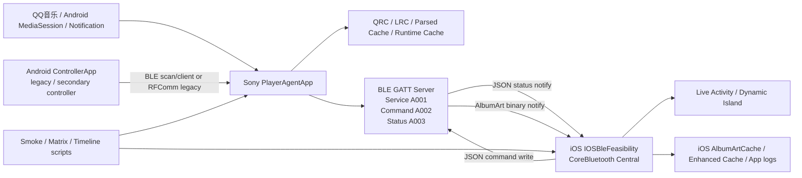
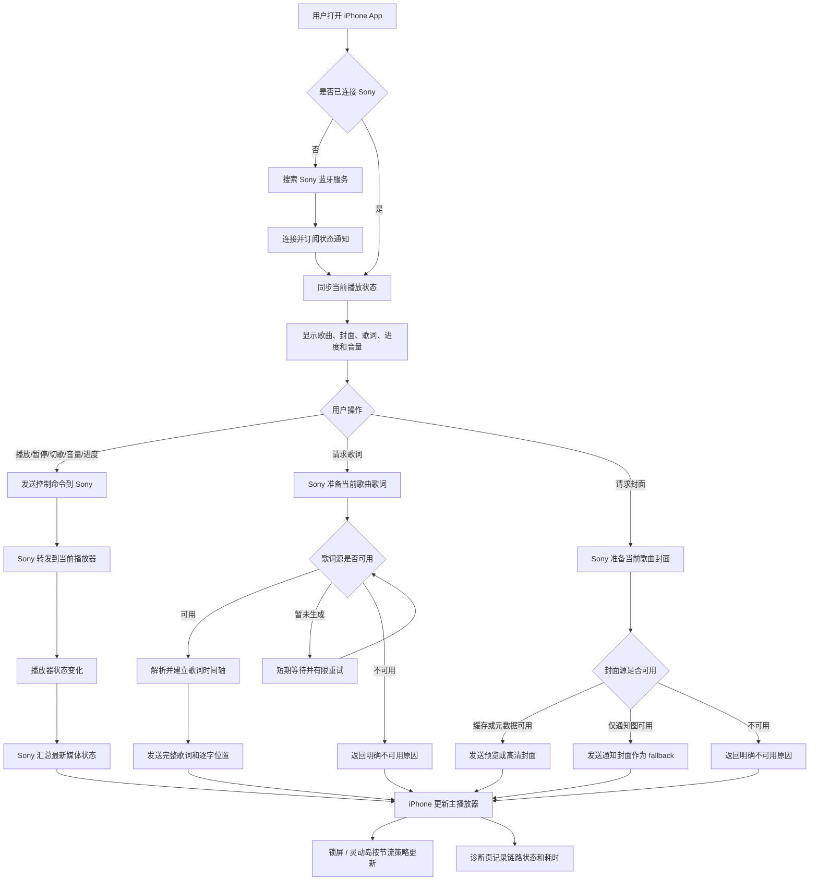
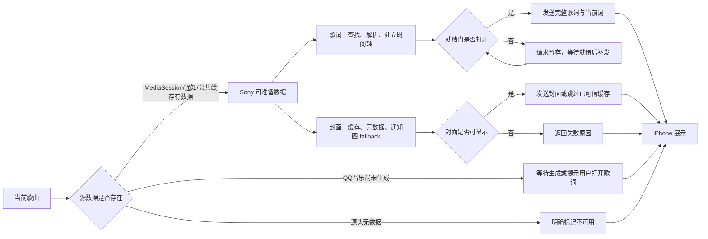
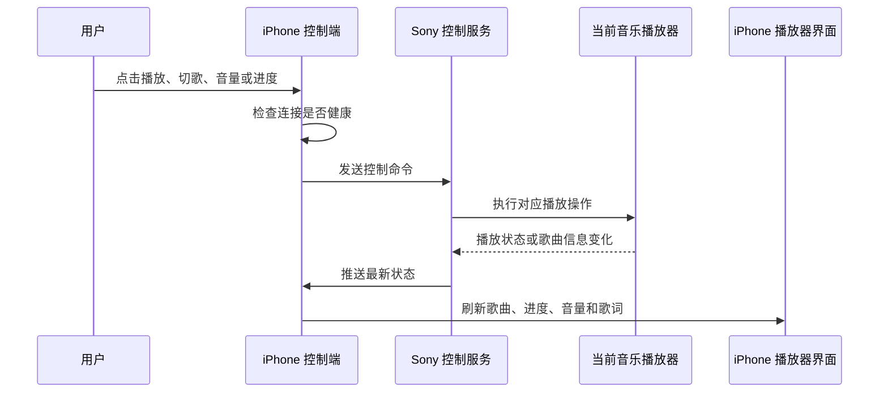
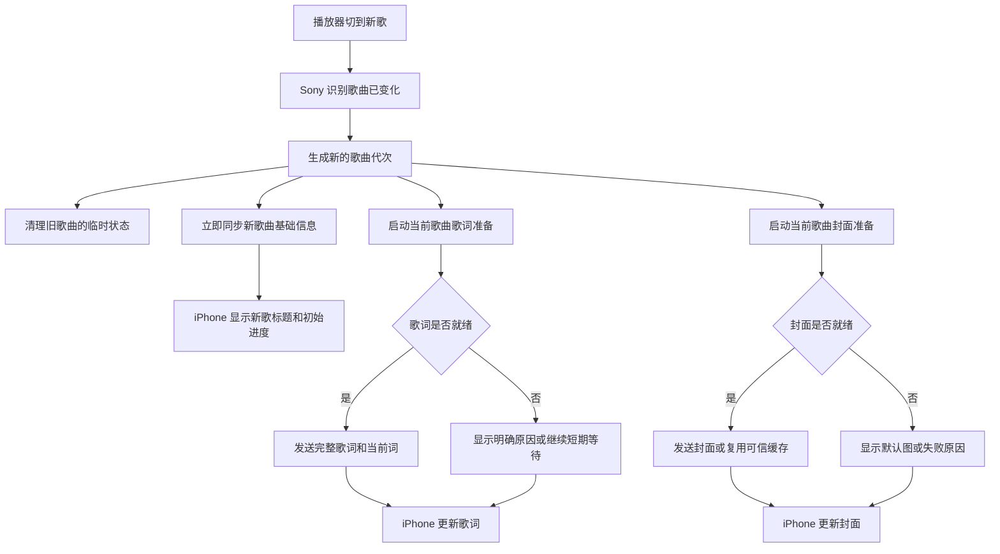
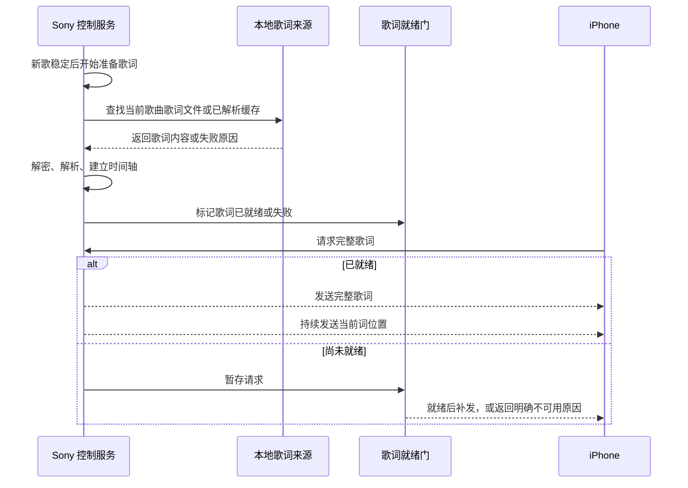
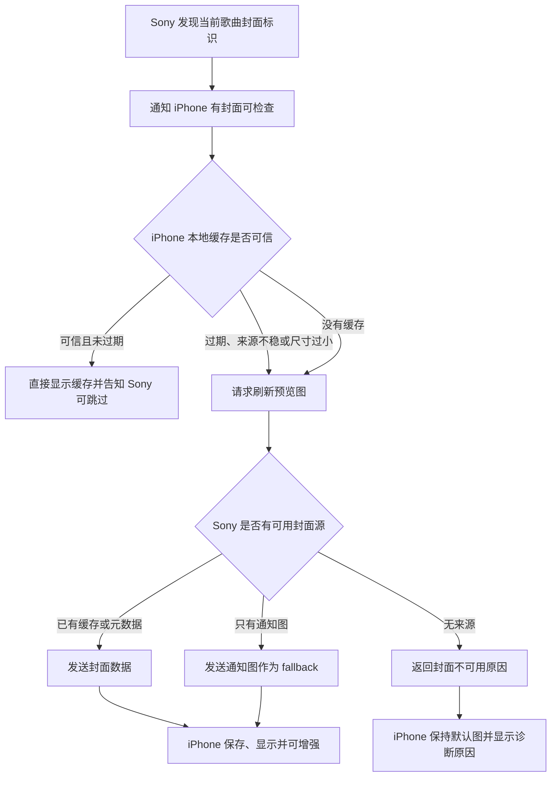

# 蓝牙音乐控制器业务流程与架构设计文档

更新时间：2026-06-28
基线说明：本文基于当前 `MusicBleController` 工作区源码编写，重点读取了 `PlayerAgentApp`、`IOSBleFeasibility`、`ControllerApp`、`docs/` 与 `tools/` 下的真实实现。本文不是产品说明，而是后续 AI / Codex 维护项目时的业务流程与架构上下文。

## 1. 项目背景与目标

MusicBleController 是一个跨 Android / iOS / Sony Android 设备的音乐控制与状态同步系统。项目核心目标是让 iPhone 或 Android 控制端通过 BLE 控制 Sony 端正在播放的 QQ音乐，并稳定获得播放状态、歌词、逐字高亮、封面、音量和诊断信息。

当前系统已经从“能控制播放”的原型，演进为以 Sony PlayerAgentApp 为权威媒体状态源的实时同步系统：

- Sony 端读取 Android MediaSession、Notification 和本地 QRC/LRC 缓存。
- Sony 端作为 BLE GATT Server 暴露固定 service / command / status characteristic。
- iOS 端作为 BLE Central 连接 Sony、写入 JSON 命令、接收 JSON 状态和 AlbumArt binary chunk。
- Android ControllerApp 仍存在，用于历史/辅助控制与调试，但当前主体验集中在 iOS + Sony。

当前重点不再是“BLE 能不能通”，而是“数据源到底是否可用、能否在 2 秒内稳定消费”。已有采样显示：

- BLE、currentWord、playbackState、主线程并非主要瓶颈。
- 歌词慢 / 失败主要来自 QQ音乐 / Sony / MediaSession 源数据可用性、QRC 生成时机、解析调度和维护任务干扰。
- AlbumArt 已显著稳定，主要剩余风险是旧封面 cache stale 和源端只提供低分辨率 notification largeIcon。

## 2. 系统整体架构



系统分为三条主链路：

| 链路 | 方向 | 主要内容 | 当前状态 |
|---|---|---|---|
| 控制链路 | iOS / Android -> Sony | 播放、切歌、音量、seek、请求歌词、请求封面 | JSON legacy 协议稳定 |
| 状态链路 | Sony -> iOS | playbackState、trackInfo、volumeState、currentWord、FullLyrics、诊断 | JSON notify 稳定 |
| 大对象链路 | Sony -> iOS | AlbumArt preview / HQ binary chunk、FullLyrics chunk | AlbumArt binary 已拆出；FullLyrics 仍 JSON chunk |

### 2.1 UI 设计图（根据当前代码生成）

以下设计图不是历史截图，也不是用户参考图的复制，而是根据当前源码中的页面结构重新绘制的界面结构图：

- iOS 主播放器：来自 `ContentView.swift` 的顶部连接胶囊、封面、歌曲信息、歌词、进度、音量、播放控制和右上菜单。
- iOS 设置/诊断：来自 `PreferencesView.swift`、`NowPlayingDiagnosticView.swift`、`SystemHealthOverviewView` 所在文件的设置分区、诊断卡片和 Quick Actions。
- Sony 调试页：来自 `PlayerAgentApp/MainActivity.kt` 的控制服务、BLE 状态、当前歌曲、歌词缓存与逐字时间、QRC 索引、缓存维护等分区。


后续调整 UI 时，应继续遵循：

- 日常模式只保留播放器核心功能，调试入口收敛到菜单和 Debug 模式。
- Sony 端服务状态和 BLE 健康状态必须分开显示。
- 构建、预热、修复、索引类任务按卡片分组，按钮随真实状态变化。
- 当前没有任务时，状态应显示在提示区，不应伪装成“按钮正在执行”。
- 执行任务刷新信息时，避免整页闪动，只更新局部状态。
- 维护任务不得抢占当前歌曲歌词链路。

### 2.2 完整业务功能流程图

下面的流程图只描述业务功能和用户可感知行为，不绑定具体类名或方法名。



### 2.3 歌词与封面的端到端业务视图



## 3. 三端模块职责

### 3.1 Sony PlayerAgentApp

Sony 端是系统权威数据源和 BLE Server。

核心文件：

| 文件 | 职责 |
|---|---|
| `PlayerAgentApp/src/main/java/com/example/playeragent/service/PlayerAgentForegroundService.kt` | 前台服务、BLE stack 启动、auto-start、Bluetooth / GATT / advertising 恢复入口 |
| `PlayerAgentApp/src/main/java/com/example/playeragent/ble/BleGattServerManager.kt` | GATT server、command write、status notify、播放状态、歌词、封面、重连同步、notify queue |
| `PlayerAgentApp/src/main/java/com/example/playeragent/ble/PlayerAgentUuids.kt` | BLE UUID 常量 |
| `PlayerAgentApp/src/main/java/com/example/playeragent/ble/BleNotifyQueue.kt` | 短/长 notify 队列，避免 AlbumArt / FullLyrics 长任务阻塞短状态 |
| `PlayerAgentApp/src/main/java/com/example/playeragent/ble/BleHealthModels.kt` | BLE 健康状态模型 |
| `PlayerAgentApp/src/main/java/com/example/playeragent/media/PlaybackStateReader.kt` | MediaSession / PlaybackState 读取、track_changed 检测、ReactiveMediaController 入口 |
| `PlayerAgentApp/src/main/java/com/example/playeragent/media/ReactiveMediaController.kt` | 事件合并、debounce、generation guard、任务调度状态 |
| `PlayerAgentApp/src/main/java/com/example/playeragent/media/LyricManager.kt` | 歌词加载、LyricsReadyState、pending FullLyrics、RuntimeCache apply、诊断 |
| `PlayerAgentApp/src/main/java/com/example/playeragent/media/QrcLyricManager.kt` | QRC 查找、缓存、解密/解析、匹配和失败原因 |
| `PlayerAgentApp/src/main/java/com/example/playeragent/media/CurrentTrackRuntimeCache.kt` | 当前歌曲内存快照、currentLine/currentWord、PlaybackStateSnapshot diff 基础 |
| `PlayerAgentApp/src/main/java/com/example/playeragent/media/CurrentWordPushEngine.kt` | 轻量 `currentWord` notify，generation guard，rate limit |
| `PlayerAgentApp/src/main/java/com/example/playeragent/media/MaintenanceGuard.kt` | 实时播放关键窗口，维护任务 defer/yield，避免阻塞当前歌曲 |
| `PlayerAgentApp/src/main/java/com/example/playeragent/media/LyricTraceLogger.kt` | `[LyricTrace]` 结构化日志 |
| `PlayerAgentApp/src/main/java/com/example/playeragent/MainActivity.kt` | Sony 端调试 UI、控制服务启动/停止、缓存/歌词维护面板 |

Sony 端承担：

- 从 MediaSession 获取 title / artist / album / duration / position / playing。
- 从 Notification / MediaMetadata 尝试获取封面。
- 从公共可访问 QRC / LRC / parsed cache 获取歌词。
- 维护 CurrentTrackRuntimeCache。
- 对 BLE central 提供控制和状态同步。
- 维护 BLE Health、Reconnect Sync、StartupGuard 和 MaintenanceGuard。

### 3.2 iOS IOSBleFeasibility

iOS 端是主控制端和主播放器 UI。

核心文件：

| 文件 | 职责 |
|---|---|
| `IOSBleFeasibility/IOSBleFeasibility/BLEUUIDs.swift` | BLE UUID 常量 |
| `IOSBleFeasibility/IOSBleFeasibility/BLETestManager.swift` | CoreBluetooth Central、命令发送、状态解析、自动重连、Health Check、FullLyrics、currentWord、Live Activity 协调 |
| `IOSBleFeasibility/IOSBleFeasibility/AlbumArtReceiver.swift` | AlbumArt offer/request/binary transfer/cache/TTL/enhancement/diagnostics |
| `IOSBleFeasibility/IOSBleFeasibility/PreferencesStore.swift` | 本地设置与 UserDefaults |
| `IOSBleFeasibility/IOSBleFeasibility/ContentView.swift` | 主播放器 UI |
| `IOSBleFeasibility/IOSBleFeasibility/DebugToolsView.swift` | 调试工具 |
| `IOSBleFeasibility/IOSBleFeasibility/NowPlayingDiagnosticView.swift` | 当前歌曲诊断 |
| `IOSBleFeasibility/IOSBleFeasibility/SystemHealthOverviewView.swift` | 系统健康总览 |
| `IOSBleFeasibility/IOSBleFeasibility/LiveActivityManager.swift` | ActivityKit 更新、节流、合并、payload size guard |
| `IOSBleFeasibility/SonyMusicLiveActivityExtension/SonyMusicLiveActivityWidget.swift` | 锁屏和 Dynamic Island 展示 |

iOS 端承担：

- 扫描并连接 Sony BLE GATT Server。
- 写入 JSON command。
- 解析 status notify。
- 本地 UI 进度 tick / position predictor。
- currentWord 接收后更新歌词高亮。
- AlbumArt binary 接收、cache、enhanced cache 和 stale TTL 校验。
- Live Activity / Dynamic Island 低频更新，避免被 currentWord 高频拖垮。
- iOS-only smoke / E2E / matrix 测试入口。

### 3.3 Android ControllerApp

ControllerApp 是 Android 控制端/历史辅助控制端。当前代码中同时存在 BLE scan/client 和旧 RFComm server 相关实现。

核心文件：

| 文件 | 职责 |
|---|---|
| `ControllerApp/src/main/java/com/example/controllerapp/MainActivity.kt` | Android 控制 UI、播放/音量/进度/歌词/封面展示 |
| `ControllerApp/src/main/java/com/example/controllerapp/ble/ControllerUuids.kt` | 与 Sony 一致的 BLE UUID |
| `ControllerApp/src/main/java/com/example/controllerapp/ble/BleScannerManager.kt` | 扫描 advertising name 为 `SonyPlayerAgent` 的设备 |
| `ControllerApp/src/main/java/com/example/controllerapp/ble/BleGattClientManager.kt` | GATT client 连接、service discovery、characteristic 查找 |
| `ControllerApp/src/main/java/com/example/controllerapp/AlbumArtReceiver.kt` | 旧 JSON/base64 AlbumArt 接收器 |

注意：本轮代码阅读确认 ControllerApp 存在 BLE client 与 legacy AlbumArt receiver，但主 UI 仍有 RFComm 相关路径。ControllerApp 是否仍是完整 BLE 控制主路径，需要进一步代码确认；当前项目主验收主要依赖 iOS + Sony。

## 4. BLE 协议说明

### 4.1 固定 UUID

协议 UUID 定义在：

- Sony：`PlayerAgentApp/src/main/java/com/example/playeragent/ble/PlayerAgentUuids.kt`
- iOS：`IOSBleFeasibility/IOSBleFeasibility/BLEUUIDs.swift`
- Android Controller：`ControllerApp/src/main/java/com/example/controllerapp/ble/ControllerUuids.kt`

| 项 | UUID / 值 |
|---|---|
| Service | `0000A001-0000-1000-8000-00805F9B34FB` |
| Command Characteristic | `0000A002-0000-1000-8000-00805F9B34FB` |
| Status Characteristic | `0000A003-0000-1000-8000-00805F9B34FB` |
| CCCD | `00002902-0000-1000-8000-00805F9B34FB` |
| Advertising Name | `SonyPlayerAgent` |
| iOS local peripheral name | `MusicControllerIOS` |

这些 UUID 是跨端兼容边界，默认禁止修改。

### 4.2 Command JSON

iOS 命令由 `BLETestManager.sendCommand(cmd:extra:)` 生成，写入 command characteristic。基础字段：

```json
{
  "cmd": "NEXT",
  "time": 1710000000000,
  "seq": 123
}
```

Sony 在 `BleGattServerManager.onCharacteristicWriteRequest` 中解析 JSON，并通过 `handleCommand()` 分发。

主要命令：

| cmd | 作用 |
|---|---|
| `PLAY_PAUSE` | 播放/暂停 |
| `NEXT` | 下一首 |
| `PREVIOUS` | 上一首 |
| `VOLUME_UP` / `VOLUME_DOWN` | 音量加减 |
| `SET_VOLUME` | 设置音量 |
| `SEEK_TO` | 跳转 position |
| `GET_PLAYBACK_STATE` | 请求 playbackState |
| `GET_VOLUME` | 请求音量 |
| `CLIENT_CAPABILITIES` | iOS 声明能力，例如 `albumArtBinary=true` |
| `GET_FULL_LYRICS` | 请求完整歌词 |
| `GET_LYRIC_SECONDARY` | 请求翻译/罗马音 |
| `GET_LYRIC_DIAGNOSTIC` | 请求歌词诊断 |
| `ALBUM_ART_REQUEST` | 请求 preview / hq 封面 |
| `ALBUM_ART_SKIP` | 告诉 Sony 当前 cache 可跳过发送 |
| `GET_LOGS` | 拉取 Sony log |
| `DUMP_MEDIA_FIELDS` | dump MediaSession/metadata 字段 |
| `GET_PLAY_HISTORY_PAGE` / `GET_PLAY_HISTORY_SINCE` / `GET_PLAY_STATS` | 播放历史/统计 |

### 4.3 Status notify JSON

Sony 通过 status characteristic notify JSON。iOS 在 `BLETestManager.parseStatus(_:)` 中按 `type` 分发。

主要 `type`：

| type | 说明 |
|---|---|
| `playbackState` | playing / position / duration / lyric 等轻量状态 |
| `trackInfo` / `trackInfoStart` / `trackInfoChunk` / `trackInfoEnd` | 歌曲信息；大字段可 chunk |
| `volumeState` | 当前音量 |
| `currentWord` | V2.3 轻量逐字推送 |
| `fullLyricsStart` / `fullLyricsChunk` / `fullLyricsEnd` | 完整歌词 |
| `fullLyricsUnavailable` | 完整歌词不可用及原因 |
| `lyricSecondaryStart` / `lyricSecondaryPart` / `lyricSecondaryEnd` | 翻译/罗马音 |
| `lyricDiagnostic` | 歌词诊断 |
| `albumArtOffer` | 当前歌曲封面 id |
| `albumArtBinaryStart` / binary chunks / `albumArtBinaryEnd` | 二进制封面传输 |
| `albumArtUnavailable` | 封面不可用 |
| `logChunk` | Sony 日志传输 |

### 4.4 AlbumArt binary chunk

AlbumArt 二进制 chunk 不走 JSON base64。iOS `didUpdateValueFor` 中如果 `data.first == 0xA1`，直接交给 `AlbumArtReceiver.handleBinaryChunk(data)`。

JSON 仍用于：

- `albumArtOffer`
- `albumArtBinaryStart`
- `albumArtBinaryEnd`
- `albumArtBinaryError`
- `albumArtUnavailable`

旧 JSON/base64 AlbumArt 仍保留为 legacy fallback。

### 4.5 JSON legacy 与 Binary V2

当前稳定协议仍是 JSON legacy。Binary Delta Protocol V2 曾进入设计阶段，但未落地为默认业务协议。原因：

- 现阶段主要瓶颈多次被证明不是 BLE JSON 字节量，而是源数据可用性、QRC 生成/解析、维护任务干扰和 cache stale。
- 直接切协议风险较高，会破坏旧 iOS / 旧 Sony 兼容。
- 当前保留 JSON fallback 是必要兼容策略。

## 5. 核心业务流程

### 5.1 控制命令流程



关键点：

- iOS 控制命令在 connection health 非 healthy/suspect 时会丢弃普通控制，避免“假连接”下缓存旧控制命令。
- Sony 收到命令后更新 `lastCommandSuccessAt`，用于 BLE Health。
- `NEXT` 会通知 `PlaybackStateReader.notifyManualNextHint(seq)`，但不引入不安全 queue guess。

### 5.2 播放状态同步

Sony 状态来源：

1. `PlaybackStateReader` 读取 MediaSession。
2. `CurrentTrackRuntimeCache.updatePlaybackState()` 更新当前歌曲快照。
3. `PlaybackStateSnapshot` 与上一发送快照 diff。
4. `PlaybackStateBuffer` 对非关键变化做 150ms 合并。
5. `BleGattServerManager` 发送 `playbackState` 和必要的 `trackInfo`。

Diff 类型定义在 `PlaybackStateDiff.kt`：

| Diff 类型 | 处理 |
|---|---|
| `TrackChanged` | 立即发送完整状态，并重置 currentWord / albumArt / lyrics 相关基线 |
| `PlaybackChanged` | 立即发送 |
| `PositionJump` | 立即发送 |
| `LyricChanged` | 立即发送 |
| `CurrentWordChanged` | 不发完整 playbackState，改走 `currentWord` |
| `NoChange` | skip |

iOS 端：

- `playbackState` 更新 `isPlaying`、`positionMs`、`displayPositionMs`、`durationMs`、`lyric`。
- `startProgressTimer()` 每 0.2 秒基于 `basePlaybackPositionMs + elapsed` 本地推进 UI 进度。
- Live Activity 的进度也基于 anchorDate/position 预测，而不是依赖高频 playbackState。

### 5.3 歌曲切换流程



注意：

- `currentTrackGeneration` 是防串歌核心。
- 旧 track 的 lyrics/currentWord/albumArt 异步任务必须在 generation mismatch 时丢弃。
- 当前存在一个已知问题：曾尝试修切歌后 iOS 进度条延迟归零，但失败后已回退到 V3.6 基线；该问题仍属于后续 P1/P2 风险。

### 5.4 歌词加载流程



#### LyricsReadyState

定义在 `QrcLyricModels.kt`：

| 状态 | 含义 |
|---|---|
| `NOT_STARTED` | 尚未开始 |
| `PARSING` | 正在 lookup / parse |
| `INDEX_BUILDING` | 正在构建索引 |
| `READY` | 可消费 |
| `FAILED` | 已失败 |
| `COOLDOWN_BLOCKED` | retry 被 cooldown 限制，但不能阻断已 READY 数据 |

#### Lyrics Ready Gate

`LyricsReadyGateSnapshot` 包含：

- `state`
- `lyricsReady`
- `trackId`
- `songKey`
- `generation`
- `lineCount`
- `reason`

核心规则：

- 只有 `lyricsReady == true` 且 `trackId/generation` 匹配时，才允许发送 FullLyrics / currentWord。
- 如果 iOS 的 `GET_FULL_LYRICS` 早于 ready，进入 pending queue。
- parse/index 完成后必须 flush pending。
- cooldown 只影响 retry，不能阻断 READY 状态消费。

#### 失败与慢路径分类

当前 timeline / matrix 报告使用的主要分类：

| 分类 | 含义 |
|---|---|
| `READY_FAST` | 2 秒内就绪 |
| `READY_SLOW` | 就绪但超过阈值 |
| `SOURCE_NOT_PROVIDED` | QRC/LRC 源头不可用 |
| `SOURCE_WAIT` | 等待 QRC 生成/出现 |
| `PARSE_SLOW` | decrypt/parse/index 阶段慢 |
| `INDEX_SLOW` | 索引构建慢 |
| `READY_GATE_DELAY` | index ready 到 gate ready 之间异常延迟 |
| `PENDING_DELAY` | iOS pending request 等待太久 |
| `BLE_SEND_SLOW` | Sony send 到 iOS 接收慢 |
| `TRACE_INCOMPLETE` | trace 缺失，不能误判为源慢 |
| `BLOCKED_BY_MAINTENANCE` | 被维护任务影响 |
| `COOLDOWN_BLOCKED` | retry/cooldown 限制 |

### 5.5 CurrentWord 轻量推送

CurrentWord 是 V2.3 之后的独立轻量通道。

Sony：

- `CurrentWordPushEngine` 从 `CurrentTrackRuntimeCache` 读取当前词。
- 每次发送前校验 trackId + generation。
- key 至少包含 `trackId|lineIndex|wordIndex|wordStartMs`。
- rate limit 约 40-60ms 量级，实际实现中存在 `MIN_PUSH_INTERVAL_MS`。
- 同一个 word 不重复发。
- track changed 时清空 `lastPushedWordKey`。

Payload 示例：

```json
{
  "type": "currentWord",
  "trackId": "bef8591999a1",
  "line": 18,
  "word": 7,
  "position": 183245,
  "timestamp": 1710000000000,
  "version": 1
}
```

iOS：

- `BLETestManager.handleCurrentWord(_:)` 接收。
- 使用 `isSameTrackId(incoming:current:)` 处理 short/full trackId 兼容。
- stale 则丢弃并记录 `[CurrentWordFence] stale discard`。
- accepted 后更新 `currentWordLineIndex/currentWordIndex/positionMs/displayPositionMs`。
- Live Activity 不随每个 currentWord 更新，只在行切换或节流窗口更新。

已验证指标摘要：

- 修复 trackId 规则后，iOS `currentWord raw/accepted` 可达到 48/48 或更高。
- stale discard 可降为 0。
- Live Activity 高频更新已隔离。

### 5.6 FullLyrics 流程

iOS：

- `requestFullLyricsIfNeeded(force:after:)` 去重同一 track 请求。
- 写入 `GET_FULL_LYRICS`，携带 `trackId`、`positionMs`、`includeWordsAroundCurrent=true`。
- 接收 `fullLyricsStart/chunk/end` 后组装 `LyricLine`。
- 收到 `fullLyricsUnavailable` 时记录 reason，并用于诊断 UI。

Sony：

- `BleGattServerManager` 处理 `GET_FULL_LYRICS`。
- `LyricManager` 如果 ready，立即返回 payload。
- 如果未 ready，进入 pending request。
- ready 后 flush pending。
- 如果不可用，返回具体 unavailable reason。

风险：

- FullLyrics 仍是 JSON chunk，长包可能与 AlbumArt/HQ 竞争 notify 队列。
- 目前主要瓶颈不是 FullLyrics 协议，而是 ready 之前的 QRC source / parse / maintenance。

### 5.7 AlbumArt 流程



iOS `AlbumArtReceiver` 负责：

- offer 处理。
- cache validation。
- source-aware TTL：
  - `notificationLargeIcon` / `unknown`：5 分钟。
  - `mediaMetadata/artUri`：30 分钟或更长。
- 小图（<=300px）和 transient source 需要 refresh，不允许永久 skip。
- binary start/chunk/end 超时保护：
  - first chunk timeout 3000ms。
  - idle chunk timeout 4000ms。
  - total timeout 10000ms。
- enhanced cache。
- Live Activity artwork thumbnail。

Sony 端负责：

- 发送 `albumArtOffer`。
- 根据 iOS 请求发送 preview / hq。
- 当前可依赖来源以 notification largeIcon 为主；MediaMetadata bitmap/iconUri/albumArtUri 在部分歌曲为空。
- AlbumArtFastPath 和 AlbumArtCache 降低切歌后空白时间。

已知边界：

- notification largeIcon 可能只有 280x280 左右，iPhone 3x 大封面会被放大，模糊是源分辨率限制。
- 如果 Sony / QQ音乐不提供 metadata artwork，也没有 notification largeIcon，则不能凭空生成正确封面。

### 5.8 Reconnect Sync

当 BLE central 连接并订阅 status CCCD 后：

1. Sony 记录 `[ReconnectSync] notify subscribed`。
2. `BleGattServerManager.scheduleReconnectStateSync()` 触发同步。
3. 同步不受 PlaybackDiff skip 限制。
4. Sony 发送当前 trackInfo / playbackState。
5. 如果 RuntimeCache 有 currentWord，发送 `currentWord reason=reconnect_sync`。
6. 如果当前封面 ready，可重新发 albumArtOffer。
7. 1 秒 cooldown 防止重复订阅打爆发送。

iOS 在 notify subscribed 后：

- 进入 reconnect state sync window。
- 发送 `CLIENT_CAPABILITIES`。
- 请求 `GET_PLAYBACK_STATE` / `GET_VOLUME`。
- 延迟请求 FullLyrics。
- 如果 reconnect playbackState 表明有歌词但本地无 FullLyrics，会主动请求。

### 5.9 BLE Health / Auto Recovery

Sony 健康状态定义在 `BleHealthModels.kt`：

| 状态 | 含义 |
|---|---|
| `SERVICE_STOPPED` | 前台 service 未运行 |
| `STARTING` | Service/GATT 初始化 |
| `ADVERTISING` | 可发现，等待连接 |
| `CONNECTED` | 有 central 连接 |
| `SUBSCRIBED` | central 已订阅 notify |
| `CONTROLLABLE` | 近期 command/notify 成功 |
| `SUSPECT` | 表面正常但长时间无成功心跳或 notify 失败 |
| `RECOVERING` | 正在 recover BLE stack |
| `ERROR` | 权限、蓝牙或恢复失败 |

`BleHealthSnapshot` 字段包括：

- `gattStarted`
- `gattState`
- `advertisingState`
- `connectedCount`
- `subscribedCount`
- `notificationInFlight`
- `pendingJobs`
- `lastCommandSuccessAt`
- `lastNotifySuccessAt`
- `notifyFailureCount`
- `lastRecoveryAt`
- `recoveryCount`
- `reason`

Sony UI 不应再把 `ForegroundService.isRunning()` 等同于 BLE 正常；真实状态要看 BLE Health。

iOS 也有独立 Health Check：

- notify subscribed 后先进入 suspect。
- 收到 status notify 后 healthy。
- 长时间无 notify -> probe `GET_PLAYBACK_STATE`。
- probe timeout 或 stale -> hard reconnect。
- 控制命令在非 healthy/suspect 时丢弃。

### 5.10 MaintenanceGuard

MaintenanceGuard 的目标是避免后台维护任务污染当前播放歌曲的歌词链路。

实时关键窗口：

- `track_changed` 后 8 秒。
- `GET_FULL_LYRICS` 后 5 秒。
- 当前歌曲 parse 正在执行时保持保护。
- lyrics ready 可提前结束。

受控维护任务包括：

- lyric recovery。
- lyrics warmup。
- cache rebuild。
- QRC index rebuild。
- fuzzy index rebuild。
- old cache repair。
- bulk QRC scan。
- full cache maintenance。

关键日志：

- `[MaintenanceGuard] realtime window start`
- `[MaintenanceGuard] realtime window end`
- `[MaintenanceGuard] defer task=... reason=realtime_window`
- `[MaintenanceGuard] block maintenance task=... reason=current_track_priority`
- `[MaintenanceGuard] current track parse priority=high`

V3.5 后维护任务干扰已被剥离，用户提供的稳定基线显示：

- `maintenanceBusyTrackCount=0`
- `currentTrackParseBlocked=false`

### 5.11 Timeline / Smoke Tests

主要测试入口：

| 脚本 | 作用 |
|---|---|
| `tools/ios-smoke-tests/run_ios_smoke_tests.sh` | iOS build/install/launch/log/settings/file/BLE optional/AlbumArt optional smoke |
| `tools/ios-smoke-tests/codex_check.sh` | Codex iOS quick smoke |
| `tools/android-smoke-tests/run_android_smoke_tests.sh` | Sony Android build/install/service/log smoke |
| `tools/smoke/run_all_smoke_tests.sh` | 跨设备 smoke 总入口 |
| `tools/smoke/control_e2e_v29_test.sh` | 真交互 E2E：play/pause/next/volume/seek/fullLyrics/albumArt |
| `tools/smoke/track_matrix_v31_test.sh` | 10-track lyrics / albumArt matrix |
| `tools/smoke/lyrics_timeline_v34_test.sh` | Lyrics timeline profiler，支持 `--sony-only` 实时 logcat collector |

V3.4.3 timeline 关键能力：

- 测试开始 `adb logcat -c`。
- 后台实时采集 `[LyricTrace]` 到 `sony_lyric_trace.log`。
- 不再依赖测试结束后的 `logcat -d`，避免 ring buffer 覆盖。
- Sony-only 模式下 iOS 文件服务失败只 WARN，不阻断 Sony trace 验证。

已有报告摘要（来自项目对话/验收记录，需以本地最新 report.json 为准）：

- Sony-only timeline PASS。
- `sonyTraceFileBytes=207356`。
- `sonyLyricTraceLineCount=932`。
- stage counts 包含 `qrcLookupStartAt`、`qrcFileFoundAt`、`qrcFileNotFoundAt`、`qrcParseEndAt`、`runtimeCacheApplyAt`、`lyricsReadyGateReadyAt`、`fullLyricsSendEndAt` 等。

## 6. Runtime Cache

`CurrentTrackRuntimeCache` 是当前实时媒体系统的核心 State Layer，只保存当前歌曲，不做历史 LRU。

`CurrentTrackSnapshot` 字段包括：

- `trackId`
- `songKey`
- `title`
- `artist`
- `album`
- `trackChangedAtMs`
- `positionMs`
- `durationMs`
- `isPlaying`
- `albumArtId`
- `lyricSource`
- `lyricLines`
- `translationLines`
- `romanizationLines`
- `currentLine`
- `currentWord`
- `lastPlaybackState`
- `lastUpdatedAtMs`
- `recoveryState`
- `albumArtState`
- `diagnosticSnapshot`
- `currentTrackGeneration`

读取原则：

- BLE `GET_PLAYBACK_STATE`、auto push、currentWord、diagnostics 应优先使用 RuntimeCache。
- track changed 时 generation 自增。
- lyrics apply 后立即基于当前 position 计算 currentLine/currentWord。
- albumArt ready 后更新 albumArtState。
- 旧 generation 任务不能污染新 track。

## 7. 调度与线程模型

### 7.1 Sony

| 组件 | 线程/调度特点 |
|---|---|
| `ForegroundService.onStartCommand` | 必须快速返回，重任务不得同步执行 |
| `StartupGuard` | App 启动 2-3 秒内阻止重型任务 |
| `BleGattServerManager` | GATT callback 接收 command，不应执行耗时 IO |
| `BleNotifyQueue` | short/long notify 隔离，长任务期间允许最新 short interleave |
| `PlaybackStateBuffer` | 单独 `PlaybackStateBufferThread`，150ms 合并 |
| `CurrentWordPushEngine` | 独立 currentWord 推送循环 |
| `LyricManager` | foreground lyric executor 处理当前歌曲；maintenance 走低优先级/可 defer 路径 |
| `MaintenanceGuard` | current track critical window 内维护任务 yield/defer |

禁止：

- 在 BLE callback 线程做 QRC 全量扫描、parse、index rebuild。
- 在 MainActivity onCreate/onResume 同步触发重型任务。
- 维护任务持有全局锁导致当前歌曲 parse 等待。

### 7.2 iOS

| 组件 | 调度特点 |
|---|---|
| `CBCentralManager` / `CBPeripheralDelegate` | BLE callback 后回主队列更新 `@Published` 状态 |
| `BLETestManager.startProgressTimer()` | 0.2 秒本地进度 tick |
| `AlbumArtReceiver` | 管理 transfer timeout、cache、HQ 延后请求、enhancement |
| `LiveActivityManager` | update debounce、payload size guard、duplicate skip、progress calibration |
| `PreferencesStore` | UserDefaults 持久化 |

注意：

- currentWord 高频接收不能导致 Live Activity 高频 update。
- AlbumArt HQ 延后请求用于避免切歌时抢 FullLyrics/BLE 通道。
- iOS 文件服务不稳定时，timeline 支持 Sony-only 模式，不应误判业务链路失败。

## 8. 优化历程与版本演进

| 阶段 | 目标 | 主要变化 | 经验 |
|---|---|---|---|
| V1 | 建立 BLE 控制与基础状态 | JSON command/status，播放/音量/歌词/封面基础链路 | 先保证协议稳定 |
| Artwork Enhancement V1 | iOS 封面视觉增强 | 本地 enhanced cache、sharpness/target size、A/B 诊断 | 280px notification icon 放大是模糊主因 |
| iOS AutoReconnect / Health | 修假连接与慢连接 | scan-first、fast retrieve timeout、health probe、hard reconnect | 旧 peripheral retrieve 等待过长会拖慢体验 |
| Sony QRC / Recovery | 歌词缓存、lazy QQMusic 处理 | lazy wait window、retryable empty、Lyric Recovery | QQ音乐歌词常懒加载，打开桌面歌词会触发缓存 |
| V2.3 | CurrentWord Lightweight Push | `type=currentWord`，trackId normalize，iOS accepted currentWord | 避免每个 word 发送完整 playbackState |
| V2.3.1 | LiveActivity Rate Isolation | currentWord 不驱动每次 LiveActivity update | App 内 UI 和锁屏刷新频率必须分离 |
| V2.4 | PlaybackState Diff / Buffer | Snapshot diff、position threshold、buffer coalesce | position 小变化不应整包发送 |
| V2.5 | Predictive Lyrics | 预测框架和诊断 | QQ音乐 queue 不可见，predictive hit 不能作为主线 |
| V2.6 | Lyrics Fast Path | track_changed 后主动歌词准备、parsed cache、pending FullLyrics | 不等待 iOS 请求才开始准备 |
| V2.6.1 | Sony Auto-start | App 启动自动开启控制服务 | 必须防重复启动和用户手动停止保护 |
| V2.7 | AlbumArt Fast Path | track_changed 后准备封面/cache/pending | 不改协议，只优化准备时机 |
| V2.8 | Reconnect Sync | notify subscribed 后快速同步 playback/currentWord/art offer | 重连后减少空白期 |
| V2.9 | Control E2E Smoke | 真实控制动作测试 | 安装/启动 smoke 不等于真实链路可用 |
| V3.0 | Source Capability | 每首歌源可用性诊断 | 需区分代码问题与源头不可用 |
| V3.1 | 10-track Matrix | 10 首歌词/封面 latency matrix | AlbumArt 已趋稳，歌词源问题突出 |
| V3.2 | External Source Research / MVP | 调研 Source Adapter；MVP 后回退 | 不联网、不读私有目录条件下收益有限 |
| V3.3 | Reactive Media Scheduling | Event/Control/State 三层；debounce/in-flight/generation | 把重复 parse 和调度抖动收敛 |
| V3.4 | Lyrics Timeline Profiler | `[LyricTrace]` 全链路时间线 | 慢在哪里必须用 trace 证明 |
| V3.4.3 | Realtime Trace Collector | adb logcat 实时落盘 | 避免 logcat ring buffer 造成 TRACE_INCOMPLETE |
| V3.5 | MaintenanceGuard | 维护任务不污染实时播放窗口 | 慢路径分析前必须剥离维护干扰 |
| V3.6 | Slow Path Trace/Retry 分类 | parse cache trace、source wait retry trace、timeline 分类修正 | 精准优化必须先有可信分类 |

## 9. 已验证不可行 / 暂缓方案

| 方案 | 结论 | 原因 |
|---|---|---|
| 修改 BLE UUID / characteristic | 禁止 | 会破坏现有 iOS/Sony 兼容 |
| 一次性切 Binary V2 | 暂缓 | 当前主要瓶颈不是 JSON 字节量 |
| 读取 QQ音乐私有缓存目录 | 不可行/不合规 | Android 11 沙盒限制，普通 App 无权限 |
| 联网歌词 fallback | 可选但改变项目性质 | 用户要求不引入联网歌词 |
| Predictive next track / queue guess | 暂缓/禁止默认启用 | QQ音乐 MediaSession queue 不可见，弱预测有错配风险 |
| 多重 parse 同一 track | 禁止 | 会造成 CPU 抖动和状态不一致 |
| UI 直接触发 parse | 禁止 | 破坏 Event/Control/State 分层 |
| FullLyrics 包间隔 10ms 实验 | 已确认失败并回退 | 会影响体验/链路稳定 |
| 继续盲目优化 BLE | 低收益 | 采样表明主要瓶颈是源数据与 ready gate |

## 10. 当前已知问题与缺陷

| 问题 | 现状 | 建议 |
|---|---|---|
| 部分歌曲歌词 2-6 秒后才出现 | V3.4/V3.5/V3.6 正在用 timeline 拆分 SOURCE_WAIT/PARSE_SLOW | 继续基于最大耗时段优化 |
| 部分歌曲 SOURCE_NOT_PROVIDED | 很可能 QQ音乐/Sony/MediaSession 源头不可用 | 明确标记，不无限 retry |
| iOS 切歌后进度条偶尔延迟归零 | 曾尝试修复但导致进度/音量/歌词异常，已回退 | 需重新小步分析，不应大改 |
| Sony BLE service alive 但 BLE 半死 | 已有 BleHealth 模型；需确认 watchdog/UI 是否完全覆盖 | 继续验证 `BleHealthSnapshot` 与 UI 一致性 |
| 旧封面 cache stale | iOS 已有 source-aware TTL；仍需真机持续验证 | 对 transient source 不永久 skip |
| ControllerApp 是否仍完整支持 BLE 主路径 | 代码存在 BLE scanner/client，但主 UI 仍有 RFComm 迹象 | 如要维护 Android 控制端，需要专项梳理 |
| QQ音乐桌面歌词触发后才有 QRC | 源端懒加载特性 | 提示用户或用 lazy wait/retry，不模拟点击 |

## 11. 当前性能数据

以下数据来自近期验收记录和报告摘要；精确值应以对应 `/tmp/.../report.json` 为准。

| 指标 | 已知数据 |
|---|---|
| CurrentWord 长测 | Sony push 可达 96；iOS raw/accepted 可达 48/48；stale discard=0 |
| CurrentWord latency | avg 约 804ms，p95 约 828ms |
| LiveActivity 高频问题 | 已通过 rate isolation 处理 |
| AlbumArt 20 首 | 用户记录显示 19/20 FAST |
| Lyrics 20 首 | 历史记录出现 READY_FAST 1/20、READY_SLOW 6-7/20、FAILED 12-14/20；需以最新 report 校准 |
| V3.4.3 Sony-only timeline | PASS；`sonyLyricTraceLineCount=932`；stage counts 非空 |
| V3.5 MaintenanceGuard | `maintenanceBusyTrackCount=0`，`currentTrackParseBlocked=false` |
| payload too large | 多轮长测记录为 0 |
| main stall | 多轮长测记录为 0 |

未确认项：

- 最新 V3.6 后 10-track / 20-track matrix 的精确 READY_FAST/READY_SLOW/FAILED 分布，需从最新 report.json 补充。
- 最新 SOURCE_WAIT 与 PARSE_SLOW 的各自占比，需从 V3.6 timeline report 补充。

## 12. 后续优化路线

### P0：只修影响稳定性的 bug

- Sony 控制服务 UI 状态必须反映 BLE Health，而不是只看 service running。
- 停止构建/维护任务必须真实取消或明确显示等待中的具体任务。
- iOS 切歌进度归零问题需重新按 trace 小步修复。

### P1：Lyrics Slow Path 精准优化

- 只针对 V3.6 timeline 证明的 `PARSE_SLOW` / `SOURCE_WAIT` 优化。
- 对 `SOURCE_WAIT` 使用有限 retry：500ms、1500ms，最多 2 次。
- 对 `PARSE_SLOW` 优先使用 fingerprint + parsed cache + index cache，禁止改 QRC 语义。

### P2：Source Truth / Capability 模型完善

- 每首歌输出 source truth：
  - 是否有 MediaSession lyrics。
  - 是否有 QQMusic public QRC。
  - 是否有 parsed cache。
  - 是否 QRC 未生成。
  - 是否源头永远不可用。
- 把“可优化”和“源限制”分开，避免无效调优。

### P3：AlbumArt 可靠性收尾

- 继续验证 transient source TTL。
- 对 notification largeIcon / unknown source cache 过期后强制 refresh。
- 不把旧 HQ cache 当成永久可信源。

### P4：Binary V2 设计验证

只有在以下条件满足时再进入：

- Lyrics source/parse 问题已基本收敛。
- FullLyrics/AlbumArt notify 队列成为明确瓶颈。
- iOS/Sony 均有能力做 version negotiation。
- Legacy JSON fallback 全程保留。

## 13. 风险清单

| 风险 | 影响 | 缓解 |
|---|---|---|
| 修改 BLE UUID / payload | 全端不兼容 | 默认禁止，除非显式协议迁移 |
| 弱匹配歌词 | 错配歌词比无歌词更糟 | 禁止 artist-only/title-only 强绑 |
| 维护任务阻塞当前歌曲 | 歌词慢/假失败 | MaintenanceGuard + high priority current track lane |
| QRC retry 无限循环 | CPU/IO 抖动 | retry 上限 + SOURCE_NOT_PROVIDED final |
| currentWord generation 串歌 | iOS stale discard 或错词 | trackId + generation guard |
| AlbumArt stale cache | 显示旧封面 | source-aware TTL + refresh-on-offer |
| LiveActivity 高频更新 | 系统限流/卡顿 | 只在行切换、歌曲切换、状态变化或节流间隔更新 |
| iOS CoreDevice 文件服务不稳定 | 测试误失败 | Sony-only timeline 模式，iOS file logs 可 WARN |
| Logcat ring buffer 覆盖 | TRACE_INCOMPLETE 误判 | 实时 collector 落盘 |
| Android startup 重任务 | Splash 卡死 / service ANR | StartupGuard + service fast return |

## 14. 总结

MusicBleController 当前已经形成较清晰的稳定版架构：

- Sony PlayerAgentApp 是权威媒体状态源。
- BLE JSON legacy 协议稳定，AlbumArt binary chunk 作为大对象优化保留。
- iOS 是主控制端和主播放器 UI，负责自动重连、健康检测、本地进度预测、AlbumArt cache/enhancement 和 Live Activity。
- CurrentTrackRuntimeCache 是 Sony 端状态层核心。
- ReactiveMediaController / PlaybackStateDiff / CurrentWordPushEngine / MaintenanceGuard 构成实时链路稳定性的关键。
- V3.4+ timeline 使歌词慢路径可以用证据分析，而不是猜测。

当前项目是否已经达到 QQ音乐 + Sony 的能力边界，不能简单回答“是”或“否”：

- 对于 AlbumArt，除少数 stale cache / source 空洞外，已接近当前源能力边界。
- 对于 Lyrics，BLE 和 UI 主链路已基本不是瓶颈；剩余优化价值集中在 `SOURCE_WAIT` 和 `PARSE_SLOW` 的证据化治理。
- 对于 `SOURCE_NOT_PROVIDED`，如果 Sony/QQ音乐/公共 QRC 都不提供，项目不应继续用 retry 或弱匹配强行“优化”。

后续最重要的原则是：先看 timeline 最大耗时段，再决定是否改代码。不要再盲目改 BLE、cache 或 retry。

## 15. 本文已确认与仍需确认

### 已从代码确认

- BLE UUID 常量。
- iOS `BLETestManager` command/status 处理框架。
- Sony `BleGattServerManager` GATT server、command dispatch、notify、reconnect sync、auto push。
- `LyricsReadyState` / `LyricsReadyGateSnapshot`。
- `CurrentTrackRuntimeCache` 当前歌曲快照模型。
- `CurrentWordPushEngine` 轻量 currentWord 通道。
- `PlaybackStateDiff` / `PlaybackStateBuffer`。
- `MaintenanceGuard` realtime window。
- `LyricTraceLogger` 固定 `[LyricTrace]` 日志格式。
- `lyrics_timeline_v34_test.sh` Sony-only real-time logcat collector。
- iOS `AlbumArtReceiver` source-aware TTL 与 binary transfer timeout。
- Live Activity update coalesce/debounce/payload guard。

### 仍需进一步代码确认

- Android ControllerApp 当前是否仍完整使用 BLE 写命令/订阅 status，还是主要保留 RFComm/legacy 控制路径。
- Sony AlbumArt 在全部分支中 MediaMetadata bitmap/artUri/displayIconUri 的实际使用比例；当前读到的发送路径主要依赖 notification largeIcon 与 cache/fast path。
- 最新 V3.6 后 20-track matrix 的精确统计，需要从最新 `/tmp/.../report.json` 补入。
- FullLyrics chunk size / send pacing 的最新具体参数，需要围绕 `BleGattServerManager` 的发送函数再做一次专项确认。
